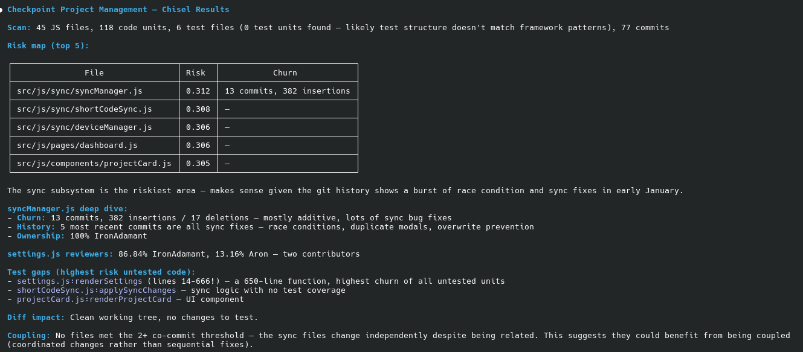

# Chisel

Test impact analysis and code intelligence **built for LLM agents** — especially when **several agents or sessions** touch the same repo (solo developer, multi-agent workflow).

Chisel maps tests to code, code to git history, and answers: **what to run, what’s risky, and where attention should go** — including blame-based lineage when you need audit context (not “team roster” features).



## Who this is for

- **Solo developers** using Cursor, Claude Code, or other MCP clients — not a substitute for human code review queues.
- **Multi-agent usage**: parallel agent runs, background tasks, or sequential sessions that share one project. Chisel keeps **one consistent graph** (project-local `.chisel/` storage, cross-process locks) so agents don’t corrupt analysis mid-write.
- **Primary interface**: MCP tools and structured responses (`next_steps`, diagnostic statuses), not dashboards for managers.

**Docs:** [Agent playbook](docs/AGENT_PLAYBOOK.md) (recommended tool loop, `start_job` / `job_status`, `source` field) · [Zero-dependency policy](docs/ZERO_DEPS.md) · [Custom extractors](docs/CUSTOM_EXTRACTORS.md) (`register_extractor`, `CHISEL_BOOTSTRAP` — bring your own tree-sitter in *your* venv).

## The Problem

An LLM agent changes `engine.py:store_document()`. It then either:
- Runs **all** 287 tests (slow, wasteful), or
- Guesses with `-k "test_store"` (misses regressions)

When **multiple agent runs** (or agents plus you) work on the same codebase, changes in one area can break another. Chisel gives each agent **test impact, import-aware suggestions, and risk signals** so they narrow what to run and where regressions may hide — before you merge or ship.

## Install

```bash
pip install chisel-test-impact
```

Or from source:

```bash
git clone https://github.com/IronAdamant/Chisel.git
cd Chisel
pip install -e .
```

## Use with Claude Code (MCP)

Add to your Claude Code MCP config (`~/.claude/settings.json` or project `.mcp.json`):

```json
{
  "mcpServers": {
    "chisel": {
      "command": "chisel-mcp",
      "env": {
        "CHISEL_PROJECT_DIR": "/path/to/your/project"
      }
    }
  }
}
```

Or run the HTTP server for any MCP-compatible client:

```bash
chisel serve --port 8377
```

Once connected, agents can call the full tool surface — `analyze`, `diff_impact`, `suggest_tests`, `risk_map`, `triage`, and more. Run `analyze` first to build the project graph, then `diff_impact` after edits to narrow which tests to run. For long analyses on large repos, prefer `chisel analyze` / `chisel update` in a terminal so MCP clients don’t time out.

## Use with Cursor / Other MCP Clients

Chisel exposes a standard MCP interface. For stdio-based clients:

```bash
pip install chisel-test-impact[mcp]
chisel-mcp
```

For HTTP-based clients, point them at `http://localhost:8377` after running `chisel serve`.

## Quickstart (CLI)

```bash
# Analyze a project (builds all graphs)
chisel analyze .

# What tests are impacted by my current changes?
chisel diff-impact

# What tests should I run for this file?
chisel suggest-tests engine.py

# Who owns this code?
chisel ownership engine.py

# What files always change together?
chisel coupling storage.py

# Which tests are stale?
chisel stale-tests

# Risk heatmap across the project
chisel risk-map

# Incremental update (only re-process changed files)
chisel update

# Find code with no test coverage, sorted by risk
chisel test-gaps
```

## Try It on This Repo

```bash
git clone https://github.com/IronAdamant/Chisel.git
cd Chisel
pip install -e .

chisel analyze .
chisel risk-map
chisel diff-impact
chisel test-gaps
chisel stats
```

## MCP tools (core)

Core query and write tools below; the MCP server also exposes **advisory file-lock** helpers for multi-process coordination. See `schemas.py` / `chisel serve` for the full list.

| Tool | What it does |
|------|-------------|
| `analyze` | Full project scan — code units, tests, git history, edges |
| `start_job` | Run `analyze` or `update` in a **background thread**; poll `job_status` (avoids MCP timeouts) |
| `job_status` | Poll a job id from `start_job` until `completed` or `failed` |
| `update` | Incremental re-analysis of changed files only |
| `impact` | Which tests cover these files/functions? |
| `diff_impact` | Auto-detect changes from `git diff`, return impacted tests |
| `suggest_tests` | Rank tests by relevance (edges, co-change, import graph) + failure rate |
| `churn` | How often does this file/function change? |
| `ownership` | Blame-based authors (useful for audit / “who wrote this line”) |
| `who_reviews` | Recent commit activity on the file (heuristic “hot spots”, not org chart) |
| `coupling` | Co-change partners + **import-graph** neighbors and numeric scores |
| `risk_map` | Risk scores for all files (churn + coupling + coverage gaps) |
| `stale_tests` | Tests pointing at code that no longer exists |
| `test_gaps` | Code units with zero test coverage, sorted by risk |
| `history` | Commit history for a specific file |
| `record_result` | Record test pass/fail for future prioritization |
| `stats` | Database summary counts |
| `triage` | Composite: top risk + gaps + stale tests in one call |

## Features

- **Zero dependencies** — stdlib only, works everywhere Python 3.11+ runs
- **Encoding-safe** — handles non-UTF-8 content in git history (Latin-1 commits, binary diffs) without crashing
- **Multi-language** — Python, JavaScript/TypeScript, Go, Rust, C#, Java, Kotlin, C/C++, Swift, PHP, Ruby, Dart
- **Framework detection** — pytest, Jest, Go test, Rust #[test], Playwright, xUnit/NUnit/MSTest, JUnit, XCTest, PHPUnit, RSpec, Minitest, gtest, Dart test
- **Incremental** — only re-processes changed files via content hashing
- **MCP servers** — both stdio and HTTP for LLM agent integration
- **Risk scoring** — weighted formula: churn, coupling, coverage gaps, author concentration, test instability
- **Branch-aware** — `diff_impact` auto-detects feature branch vs main
- **Optional custom extractors** — `register_extractor()` + `CHISEL_BOOTSTRAP` for your own tree-sitter/LSP stack (user-installed; core stays stdlib-only)

## Ecosystem

Chisel is designed to sit **in the agent loop** (MCP): impact → tests → record results → refresh analysis. It works standalone or alongside tools like [Stele](https://github.com/IronAdamant/Stele) for semantic code context — Chisel stays focused on **test graph, git signals, and static imports** for blast-radius reasoning.

## Design Notes

### Coupling: co-change vs. import-graph

Chisel's `coupling` tool exposes two coupling sources:

1. **Co-change coupling** (`co_change_partners`) — files that often appear in the same git commits. Stronger when **history has many small commits** (including a solo dev committing often, or multiple agents landing separate commits). Sparse history → thin co-change signal.

2. **Import-graph coupling** (`import_partners`, plus numeric `import_coupling` / `effective_coupling`) — static `import`/`require` edges. **Always available** after analysis and is the main structural signal for single-author repos.

`risk_map` and impact tools combine both; import graph also powers **transitive test suggestions** (e.g. facade tests covering inner modules).

### Coverage Gap: Graduated Scoring

Coverage gap is quantized to 4 steps (0.0, 0.25, 0.5, 0.75, 1.0) rather than binary. This graduated scoring provides finer granularity for risk assessment in `risk_map`.

### `--verbose` Flag

`chisel analyze` does not accept a `--verbose` flag. Using it causes the command to silently fail. For diagnostic output after analysis, use `chisel stats` to verify edge counts.

## License

MIT
